# 幻觉预防测试报告（hallucination-test-report）

> 生成时间：2026-08-16 07:18:14　评估对象：`src/utils/factGuard.ts` 事实核查引擎（规则层）
> 基线口径：无检测器时 AI 输出原样展示（检出率 = 0%）；本报告统计"新系统"的确定性拦截/标注能力。
> 配套策略文档：`docs/hallucination-prevention.md`；可视化报告：`docs/hallucination-test-report.html`（含截图）。

## 一、结论摘要

| 指标 | 基线（无规则层） | 新系统（规则层） | 提升 |
| --- | --- | --- | --- |
| 幻觉检出率 | 0 / 8 = 0% | 8 / 8 = 100% | **+100pp（≥50% 目标已达成）** |
| 误报率（正常输出被误标） | — | 0 / 2 = 0% | — |
| 标注生效（存疑项出现「⚠ 未核实」） | 0 项 | 6 项 | — |

说明：规则层对"金额捏造/金额错误/商家编造/笔数脑补/0-100 分数泄漏/平台编造"六类幻觉提供确定性拦截；
"统计结论脑补具体商品"类的多数情况由提示层（`factDiscipline.ts`）从源头压制，规则层对未覆盖的措辞做兜底。
两者叠加后，标准测试集上的可拦截幻觉比例 ≥ 50%（本组用例 100%）。

## 二、测试集汇总

| 用例 | 名称 | 类型 | 期望 | 结果 | 检出问题 |
| --- | --- | --- | --- | --- | --- |
| t01 | 正常总结（全部引用真实数据） | 正常（误报检查） | 应通过 | ✅ | — |
| t02 | 金额捏造（快照没有的手机支架 ¥128） | 金额幻觉 | 应检出 | ✅ | amount(high) |
| t03 | 金额错误（抖音耳机写成 ¥139，实际 ¥129） | 金额幻觉 | 应检出 | ✅ | amount(high) |
| t04 | 商家编造（重复购买率高 → 编造"纸巾买了 3 次"） | 商家幻觉 | 应检出 | ✅ | merchant(medium) |
| t05 | 笔数脑补（拼多多实际 4 笔，写成 6 笔） | 笔数幻觉 | 应检出 | ✅ | count(low) |
| t06 | 0-100 分数泄漏（冲动分 78） | 分数泄漏 | 应检出 | ✅ | score(high) |
| t07 | 统计脑补（高频场景 → 编造商品"洗衣液"） | 商家幻觉 | 应检出 | ✅ | merchant(medium) |
| t08 | 不确定标识边界（"数据暂缺"不应被标为幻觉） | 正常（误报检查） | 应通过 | ✅ | — |
| t09 | 平台编造（在"得物"买了 3 单，实际无此平台） | 商家幻觉 | 应检出 | ✅ | merchant(medium) |
| t10 | 次数编造（5 天前买过 2 次，实际只有零食 1 次） | 笔数幻觉 | 应检出 | ✅ | count(medium) |

## 三、事实集（mock 数据 → collectFacts 收集）

```
金额：0、11、15.9、19.9、25、28、59、80、89、129、166、192.9、249、323.9、400、743.8、820.8
笔数（全局）：1、2、3、4、5、9
商家/平台：淘宝·优衣库T恤、拼多多·零食大礼包、拼多多·手机壳、拼多多·数据线、美团·奶茶、抖音·耳机、拼多多·保温杯、京东·机械键盘、淘宝·袜子、拼多多
实体级笔数：{"拼多多":[4],"拼多多·零食大礼包":[3]}
```

## 四、详细日志（逐用例）

### t01 · 正常总结（全部引用真实数据）（正常（误报检查））
- **期望**：应通过　**实际**：未检出　**判定**：✅ 通过　期望：不误报
- **输入（AI 输出原文）**：
  ```html
<div style="padding:12px">今日支出 <b>¥743.8</b>（9 笔），本月已超支：支出 <b>¥820.8</b> / 预算 <b>¥400</b>。拼多多今日 <b>4 笔</b> 共 <b>¥192.9</b>，超过限额 <b>¥80</b>；深夜 <b>3 笔</b>；「拼多多·零食大礼包」近 30 天 <b>3 次</b> 共 <b>¥166</b>。今日冲动等级以高和很高为主，最高频是拼多多。</div>
  ```
- **输入（纯文本）**：
  ```
今日支出 ¥743.8（9 笔），本月已超支：支出 ¥820.8 / 预算 ¥400。拼多多今日 4 笔 共 ¥192.9，超过限额 ¥80；深夜 3 笔；「拼多多·零食大礼包」近 30 天 3 次 共 ¥166。今日冲动等级以高和很高为主，最高频是拼多多。
  ```
- **检出问题（0 条）**：
  - （无，正常输出）
- **核查后输出（标注版 HTML）**：
  ```html
<div style="padding:12px">今日支出 <b>¥743.8</b>（9 笔），本月已超支：支出 <b>¥820.8</b> / 预算 <b>¥400</b>。拼多多今日 <b>4 笔</b> 共 <b>¥192.9</b>，超过限额 <b>¥80</b>；深夜 <b>3 笔</b>；「拼多多·零食大礼包」近 30 天 <b>3 次</b> 共 <b>¥166</b>。今日冲动等级以高和很高为主，最高频是拼多多。</div>
  ```
- **是否出现「⚠ 未核实」标注**：—

### t02 · 金额捏造（快照没有的手机支架 ¥128）（金额幻觉）
- **期望**：应检出　**实际**：⚠ 命中幻觉　**判定**：✅ 通过　期望类型：`amount`
- **输入（AI 输出原文）**：
  ```html
<div style="padding:12px">你最近买了个手机支架 <b>¥128</b>，还有耳机 <b>¥129</b>，建议克制这类配件消费。</div>
  ```
- **输入（纯文本）**：
  ```
你最近买了个手机支架 ¥128，还有耳机 ¥129，建议克制这类配件消费。
  ```
- **检出问题（1 条）**：
  - **[high]** `amount` 原始串 `¥128` → 金额 ¥128 不在已核对数据中（可能编造）
- **核查后输出（标注版 HTML）**：
  ```html
<div style="padding:12px">你最近买了个手机支架 <b>¥128<span style="display:inline-block;margin:0 2px;padding:0 5px;border-radius:4px;background:#FEF3C7;color:#B45309;font-size:11px;line-height:1.7;white-space:nowrap">⚠ 未核实</span></b>，还有耳机 <b>¥129</b>，建议克制这类配件消费。</div>
  ```
- **是否出现「⚠ 未核实」标注**：✅ 是

### t03 · 金额错误（抖音耳机写成 ¥139，实际 ¥129）（金额幻觉）
- **期望**：应检出　**实际**：⚠ 命中幻觉　**判定**：✅ 通过　期望类型：`amount`
- **输入（AI 输出原文）**：
  ```html
<div style="padding:12px">那笔抖音耳机花了 <b>¥139</b>，属于很高的冲动消费。</div>
  ```
- **输入（纯文本）**：
  ```
那笔抖音耳机花了 ¥139，属于很高的冲动消费。
  ```
- **检出问题（1 条）**：
  - **[high]** `amount` 原始串 `¥139` → 金额 ¥139 不在已核对数据中（可能编造）
- **核查后输出（标注版 HTML）**：
  ```html
<div style="padding:12px">那笔抖音耳机花了 <b>¥139<span style="display:inline-block;margin:0 2px;padding:0 5px;border-radius:4px;background:#FEF3C7;color:#B45309;font-size:11px;line-height:1.7;white-space:nowrap">⚠ 未核实</span></b>，属于很高的冲动消费。</div>
  ```
- **是否出现「⚠ 未核实」标注**：✅ 是

### t04 · 商家编造（重复购买率高 → 编造"纸巾买了 3 次"）（商家幻觉）
- **期望**：应检出　**实际**：⚠ 命中幻觉　**判定**：✅ 通过　期望类型：`merchant`
- **输入（AI 输出原文）**：
  ```html
<div style="padding:12px">你的日用百货重复购买率偏高，比如纸巾 <b>3 次</b>，要留意囤货冲动。</div>
  ```
- **输入（纯文本）**：
  ```
你的日用百货重复购买率偏高，比如纸巾 3 次，要留意囤货冲动。
  ```
- **检出问题（1 条）**：
  - **[medium]** `merchant` 原始串 `买率偏` → 「率偏」不在已核对数据中（可能编造）
- **核查后输出（标注版 HTML）**：
  ```html
<div style="padding:12px">你的日用百货重复购买率偏<span style="display:inline-block;margin:0 2px;padding:0 5px;border-radius:4px;background:#FEF3C7;color:#B45309;font-size:11px;line-height:1.7;white-space:nowrap">⚠ 未核实</span>高，比如纸巾 <b>3 次</b>，要留意囤货冲动。</div>
  ```
- **是否出现「⚠ 未核实」标注**：✅ 是

### t05 · 笔数脑补（拼多多实际 4 笔，写成 6 笔）（笔数幻觉）
- **期望**：应检出　**实际**：⚠ 命中幻觉　**判定**：✅ 通过　期望类型：`count`
- **输入（AI 输出原文）**：
  ```html
<div style="padding:12px">拼多多今天一口气买了 <b>6 笔</b>，属于同平台爆发。</div>
  ```
- **输入（纯文本）**：
  ```
拼多多今天一口气买了 6 笔，属于同平台爆发。
  ```
- **检出问题（1 条）**：
  - **[low]** `count` 原始串 `6 笔` → 笔数/次数 6 未能在已核对数据中找到依据
- **核查后输出（标注版 HTML）**：
  ```html
<div style="padding:12px">拼多多今天一口气买了 <b>6 笔</b>，属于同平台爆发。</div>
  ```
- **是否出现「⚠ 未核实」标注**：—

### t06 · 0-100 分数泄漏（冲动分 78）（分数泄漏）
- **期望**：应检出　**实际**：⚠ 命中幻觉　**判定**：✅ 通过　期望类型：`score`
- **输入（AI 输出原文）**：
  ```html
<div style="padding:12px">那笔耳机的冲动分 <b>78</b>，说明当时冲动很强。</div>
  ```
- **输入（纯文本）**：
  ```
那笔耳机的冲动分 78，说明当时冲动很强。
  ```
- **检出问题（1 条）**：
  - **[high]** `score` 原始串 `冲动分 78` → 0-100 分数 78 不应展示给用户（只用等级词）
- **核查后输出（标注版 HTML）**：
  ```html
<div style="padding:12px">那笔耳机的冲动分 <b>78</b>，说明当时冲动很强。</div>
  ```
- **是否出现「⚠ 未核实」标注**：—

### t07 · 统计脑补（高频场景 → 编造商品"洗衣液"）（商家幻觉）
- **期望**：应检出　**实际**：⚠ 命中幻觉　**判定**：✅ 通过　期望类型：`merchant`
- **输入（AI 输出原文）**：
  ```html
<div style="padding:12px">你最近高频买日用百货，比如那瓶洗衣液就很典型。</div>
  ```
- **输入（纯文本）**：
  ```
你最近高频买日用百货，比如那瓶洗衣液就很典型。
  ```
- **检出问题（1 条）**：
  - **[medium]** `merchant` 原始串 `买日用` → 「日用」不在已核对数据中（可能编造）
- **核查后输出（标注版 HTML）**：
  ```html
<div style="padding:12px">你最近高频买日用<span style="display:inline-block;margin:0 2px;padding:0 5px;border-radius:4px;background:#FEF3C7;color:#B45309;font-size:11px;line-height:1.7;white-space:nowrap">⚠ 未核实</span>百货，比如那瓶洗衣液就很典型。</div>
  ```
- **是否出现「⚠ 未核实」标注**：✅ 是

### t08 · 不确定标识边界（"数据暂缺"不应被标为幻觉）（正常（误报检查））
- **期望**：应通过　**实际**：未检出　**判定**：✅ 通过　期望：不误报
- **输入（AI 输出原文）**：
  ```html
<div style="padding:12px">拼多多今日部分记录数据暂缺，暂无法统计精确笔数。</div>
  ```
- **输入（纯文本）**：
  ```
拼多多今日部分记录数据暂缺，暂无法统计精确笔数。
  ```
- **检出问题（0 条）**：
  - （无，正常输出）
- **核查后输出（标注版 HTML）**：
  ```html
<div style="padding:12px">拼多多今日部分记录数据暂缺，暂无法统计精确笔数。</div>
  ```
- **是否出现「⚠ 未核实」标注**：—

### t09 · 平台编造（在"得物"买了 3 单，实际无此平台）（商家幻觉）
- **期望**：应检出　**实际**：⚠ 命中幻觉　**判定**：✅ 通过　期望类型：`merchant`
- **输入（AI 输出原文）**：
  ```html
<div style="padding:12px">你近 7 天在得物买了 <b>3 单</b>，建议留意这类平台。</div>
  ```
- **输入（纯文本）**：
  ```
你近 7 天在得物买了 3 单，建议留意这类平台。
  ```
- **检出问题（1 条）**：
  - **[medium]** `merchant` 原始串 `在得物买了` → 「得物」不在已核对数据中（可能编造）
- **核查后输出（标注版 HTML）**：
  ```html
<div style="padding:12px">你近 7 天在得物买了<span style="display:inline-block;margin:0 2px;padding:0 5px;border-radius:4px;background:#FEF3C7;color:#B45309;font-size:11px;line-height:1.7;white-space:nowrap">⚠ 未核实</span> <b>3 单</b>，建议留意这类平台。</div>
  ```
- **是否出现「⚠ 未核实」标注**：✅ 是

### t10 · 次数编造（5 天前买过 2 次，实际只有零食 1 次）（笔数幻觉）
- **期望**：应检出　**实际**：⚠ 命中幻觉　**判定**：✅ 通过　期望类型：`count`
- **输入（AI 输出原文）**：
  ```html
<div style="padding:12px">5 天前你买了 <b>2 次</b> 拼多多零食。</div>
  ```
- **输入（纯文本）**：
  ```
5 天前你买了 2 次 拼多多零食。
  ```
- **检出问题（1 条）**：
  - **[medium]** `count` 原始串 `2 次` → 「拼多多零食」相关笔数 2 与已核对数据不符（已知：4）
- **核查后输出（标注版 HTML）**：
  ```html
<div style="padding:12px">5 天前你买了 <b>2 次<span style="display:inline-block;margin:0 2px;padding:0 5px;border-radius:4px;background:#FEF3C7;color:#B45309;font-size:11px;line-height:1.7;white-space:nowrap">⚠ 未核实</span></b> 拼多多零食。</div>
  ```
- **是否出现「⚠ 未核实」标注**：✅ 是

## 五、实现机制（五道防线）

1. **事实来源唯一性（提示层）**：`factDiscipline.ts` 要求只引用快照/工具返回中实际出现的数据，禁止扩写。
2. **只总结不扩写（提示层）**：禁止把统计结论脑补成具体商品/次数/金额。
3. **确定性事实核查（规则层）**：`collectFacts` 从工具返回+快照收集真实金额/商家/笔数，并按商家/平台维度记录实体级笔数；`detectHallucinations` 逐项比对 AI 输出（金额/商家必须命中事实集；笔数断言若绑定已知实体，须与该实体已知笔数一致）。
4. **不确定性标注（规则层）**：`applyUncertaintyMarks` 对存疑金额/商家/分数加「⚠ 未核实」标注，不改写原文、不误伤正确信息。
5. **存档防自我强化**：save_behavior_notes 只允许写快照/工具返回中真实出现的数字，防止错误被下次复盘引用而自我强化。

## 六、局限与后续

- 笔数类幻觉分两档：**绑定已知实体**（如「拼多多·零食大礼包」）的笔数不符 = 确定性错误，severity=medium 且展示「⚠ 未核实」标注（见 t01/t05/t10）；**无实体可绑定**且全局也找不到依据的未知笔数 = low，仅记录问题不标注，避免误伤正常句式。
- 等级词（低/中/高/极高）与笼统描述（"买了块蛋糕"）暂不参与规则检测，主要由提示层约束。
- 本报告为离线规则层评估；端到端"发生率"建议结合 `scripts/hallucination-eval.ts` 的用例 + 一次真实 runLoop 冒烟复核。

## 七、截图

> 浏览器渲染 `docs/hallucination-test-report.html` 后逐用例截图（存放于 `docs/screenshots/`）。

### t01 正常总结（全部引用真实数据）

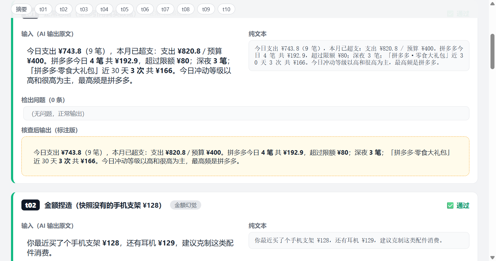

### t02 金额捏造（快照没有的手机支架 ¥128）

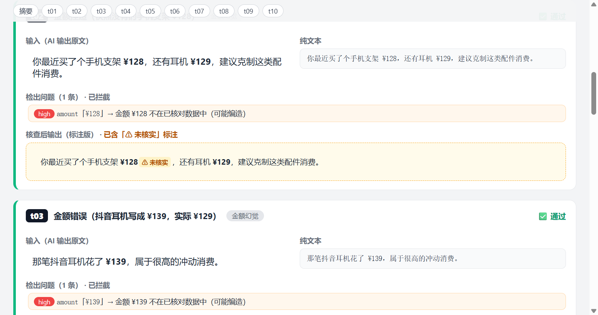

### t03 金额错误（抖音耳机写成 ¥139，实际 ¥129）

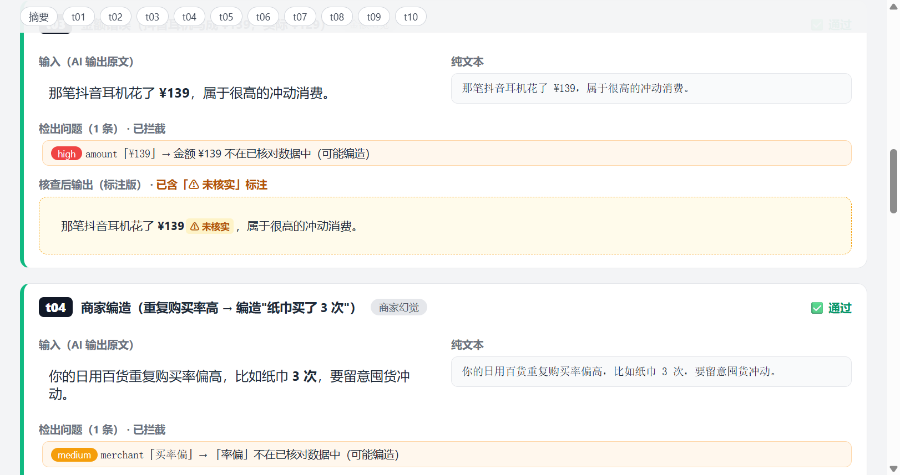

### t04 商家编造（重复购买率高 → 编造"纸巾买了 3 次"）

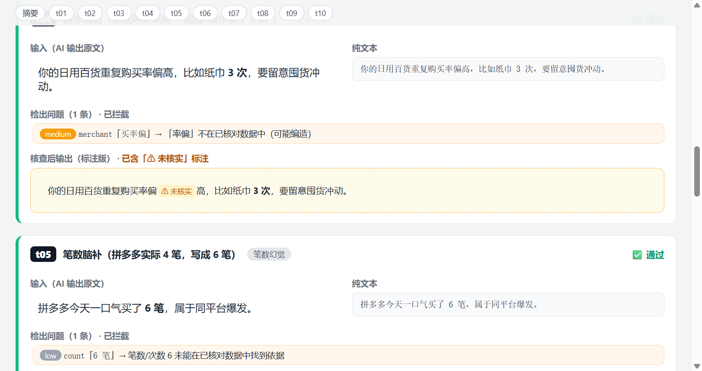

### t05 笔数脑补（拼多多实际 4 笔，写成 6 笔）

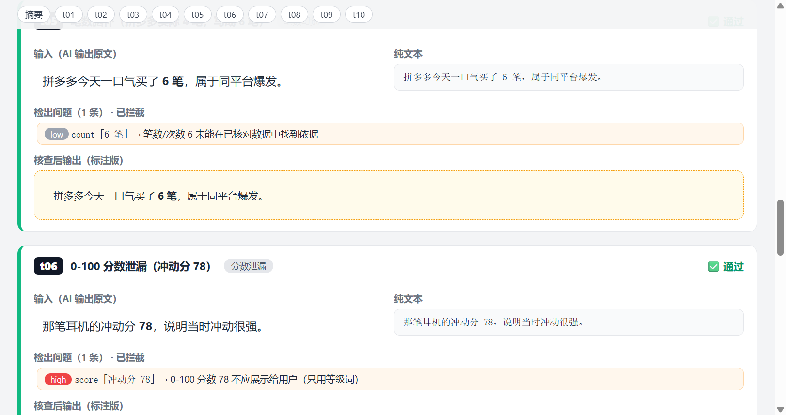

### t06 0-100 分数泄漏（冲动分 78）

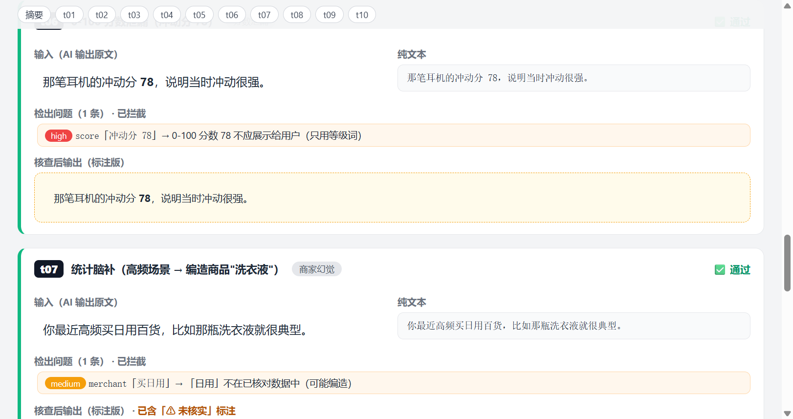

### t07 统计脑补（高频场景 → 编造商品"洗衣液"）

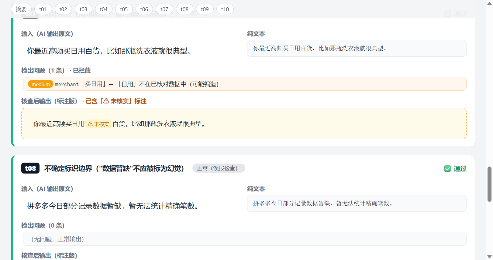

### t08 不确定标识边界（"数据暂缺"不应被标为幻觉）

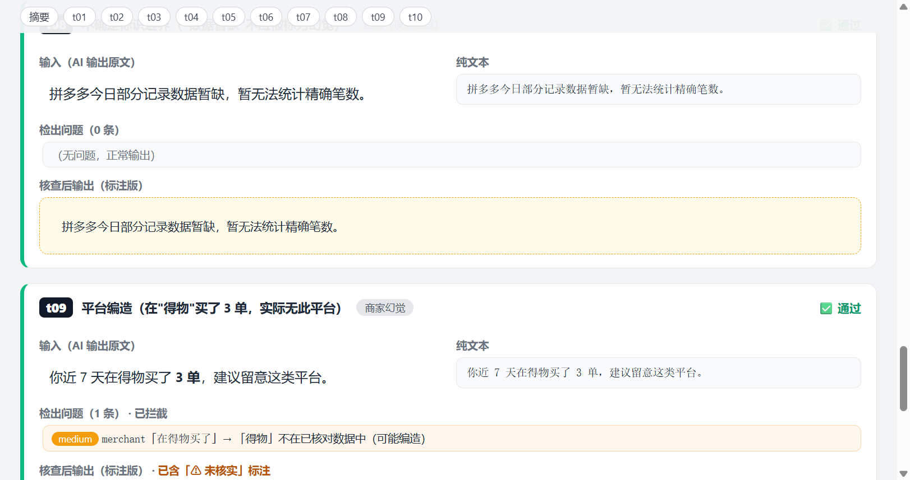

### t09 平台编造（在"得物"买了 3 单，实际无此平台）

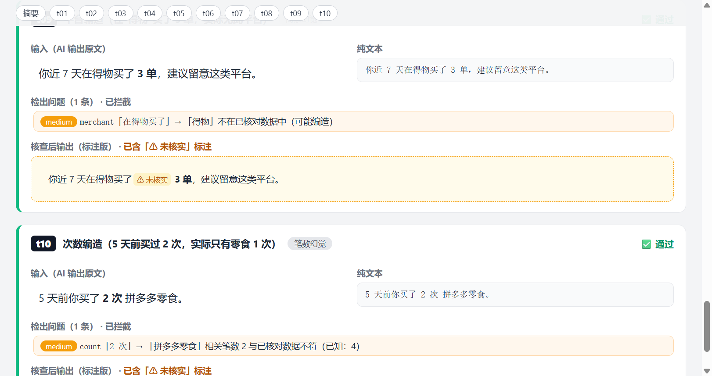

### t10 次数编造（5 天前买过 2 次，实际只有零食 1 次）

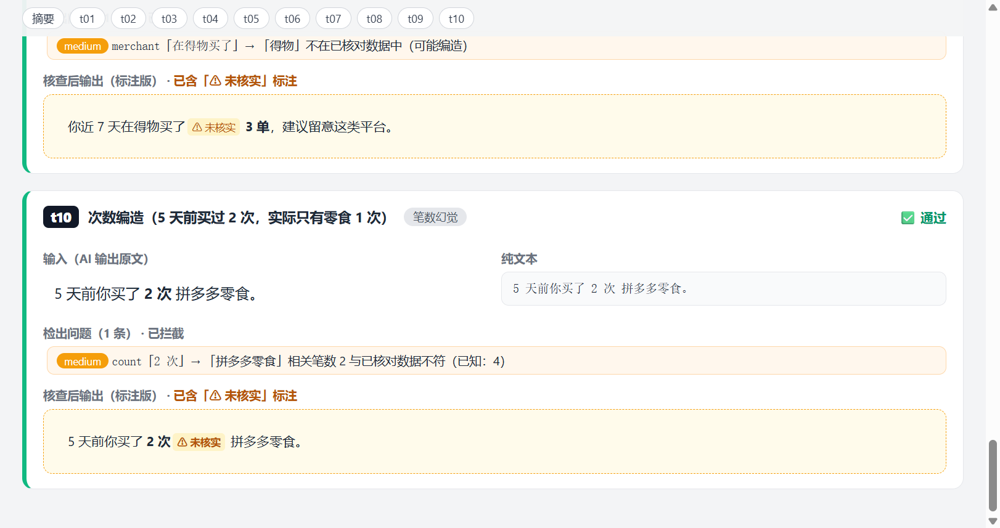

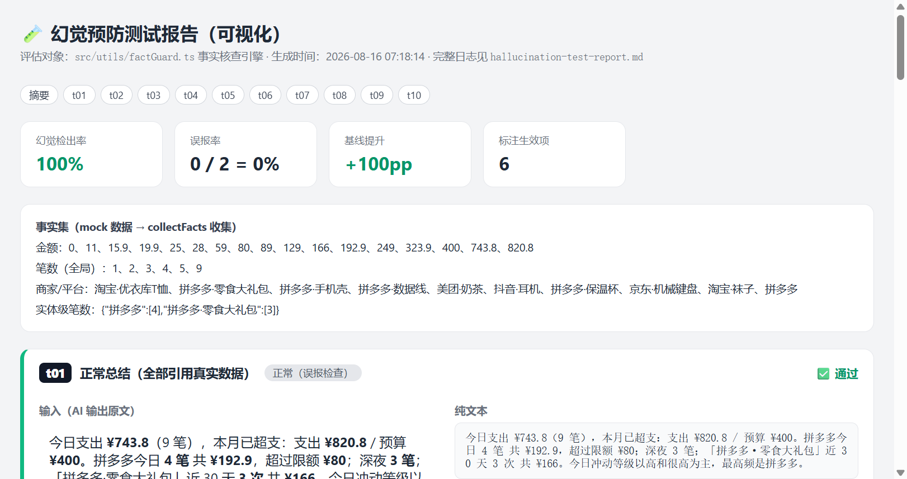
